# Examples

## Sequence region

<figure markdown>
  
  <figcaption>Fig. Single bar</figcaption>
</figure>

<figure markdown>
  
  <figcaption>Fig. Two bars</figcaption>
</figure>

## Repeat region

<figure markdown>
  
  <figcaption>Fig. Single repeat</figcaption>
</figure>

<figure markdown>
  
  <figcaption>Fig. Consecutive repeats</figcaption>
</figure>

<figure markdown>
  
  <figcaption>Fig. Implicit repeat start</figcaption>
</figure>

## Variation region

<figure markdown>
  
  <figcaption>Fig. Variation</figcaption>
</figure>

<figure markdown>
  
  <figcaption>Fig. Variation and repeat</figcaption>
</figure>

## Da Capo

<figure markdown>
  
  <figcaption>Fig. Da Capo</figcaption>
</figure>

<figure markdown>
  
  <figcaption>Fig. Da Capo when auftakt the last bar length is not full length</figcaption>
</figure>

<figure markdown>
  
  <figcaption>Fig. Da Capo when auftakt the last bar length is full length</figcaption>
</figure>

<figure markdown>
  
  <figcaption>Fig. Da Capo without Fine</figcaption>
</figure>

<figure markdown>
  
  <figcaption>Fig. Da Capo with Coda without Fine</figcaption>
</figure>

## Dal Segno

<figure markdown>
  
  <figcaption>Fig. Dal Segno</figcaption>
</figure>

<figure markdown>
  
  <figcaption>Fig. Dal Segno with Coda and Fine</figcaption>
</figure>
